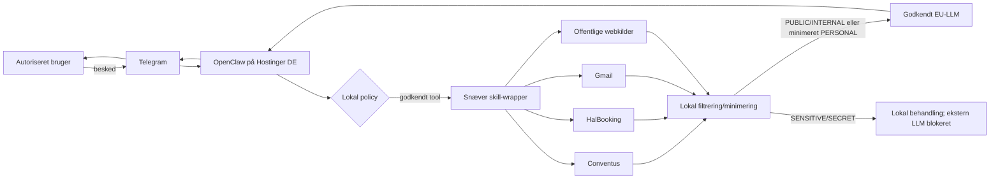
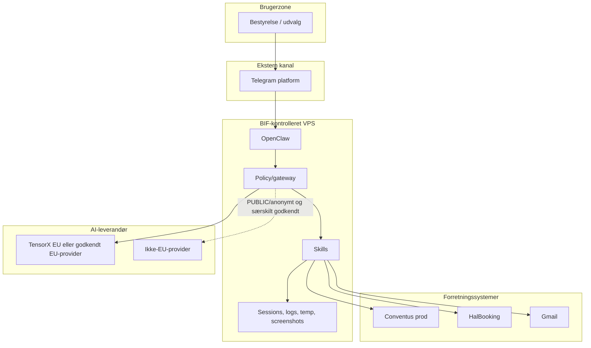
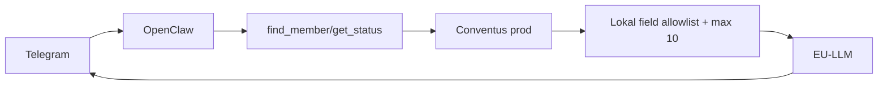
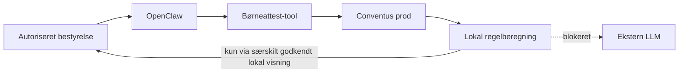
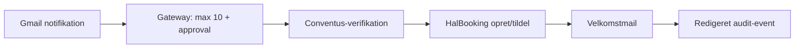

# Systemarkitektur

## Fakta, oplyst forhold og ukendt

| Forhold | Status | Kilde |
|---|---|---|
| Ni skills i monorepo | Verificeret | `skills.manifest.json` |
| To Telegram/OpenClaw-agenter | Dokumenteret, deployment ikke verificeret | `docs/openclaw-setup.md:16-19` |
| Hostinger VPS i Tyskland | Oplyst i opgaven | Ikke i repo |
| Conventus er én produktionsinstans | Oplyst i opgaven | Ikke i repo |
| TensorX som EU-provider | Ønsket arkitektur | Ingen endpoint/model/config i repo |
| LLM-provider, model, region og fallback | UKENDT | Ingen tracket runtimekonfiguration |
| GitHub Actions/deployment | Ikke fundet | Ingen trackede workflows/Docker/compose-filer |
| Fire `agents/openai.yaml`-filer | Verificeret UI-metadata | Fonde, økonomi, kontingentberegner og vedtægter; ingen runtimecredentials/routing |

## Komponenter

- **Telegram:** brugerkanal; identitets- og retentionkontroller er eksterne.
- **OpenClaw på Hostinger:** agent-runtime, toolvalg, modelrouting, sessioner og gateway. Konfiguration
  mangler i repoet.
- **Skills/wrappers:** Python CLI-kontrakter. Standard-wrapperne har read-only allowlists, mens
  særskilte admin-wrappers kun accepterer dokumenterede write-/bulk-actions med Python-approvalgate.
  Den faktiske OpenClaw-whitelist og separate servicekonti er ikke verificeret.
- **Conventus:** XML API med credentials i query string og Playwright-browserautomation.
- **HalBooking:** Playwright-browserautomation til opslag, medlemsændringer, e-mail og booking.
- **Gmail/Google OAuth:** læser, labeler, markerer læst og sender statusmails.
- **Fonds-/webkilder:** offentlige websites, EU Search API, statsligt CSV, DGI-regneark,
  Fundraising Club og allowlistet OneDrive/SharePoint-download.
- **GitHub:** kildekode og dokumentation; ingen produktionsecrets/persondata må ligge her.
- **Codex:** udviklingsværktøj til repo og syntetiske tests, ikke produktionsdatabehandler i dette design.
- **TensorX/øvrige LLM-providers:** skal ligge bag OpenClaw-gatewayen; ingen direkte systemadgang.

`agents/openai.yaml` under fire skills er præsentationsmetadata til skill-listen, ikke selvstændige
runtime-agenter. De to OpenClaw-agentdefinitioner findes kun som dokumenteret målopsætning i
`docs/openclaw-setup.md`; deres faktiske konfiguration, tools og modelrouting er ikke tracket.

## Kodeafhængigheder med betydning for dataflow

| Pakke | Skills | Funktion / dataflow |
|---|---|---|
| `python-dotenv` | Conventus, HalBooking, onboarding, baner, børneattest, fonde | Indlæser lokale env-filer; production secrets skal komme fra secret store/runtime |
| `playwright` | Baner, Conventus, HalBooking, onboarding | Browserlogin, read/write og mulig diagnostik mod eksterne systemer |
| `google-api-python-client`, `google-auth*` | HalBooking, onboarding | Gmail OAuth, read/modify/send |
| `requests`, `beautifulsoup4` | Fondsansøgning | HTTP-kald og parsing af offentlige/licenserede kilder |
| `openpyxl` | Fondsansøgning | Lokal import af XLSX, mulig historik med PERSONAL |
| `tzdata` | Fondsansøgning | Deterministisk tidszonebehandling; intet selvstændigt dataflow |

Der er ingen databaseengine. Fonds-skillen bruger et filbaseret JSON/JSONL-store; browser-skills kan
kun persistere screenshots ved eksplicit opt-in. Cachede discovery-data fra Google er deaktiveret med
`cache_discovery=False`; øvrige runtime-/providercaches er ukendte.

## Overordnet dataflow

Den stiplede realitet er, at `P`, provider-lock og `M` endnu ikke er dokumenteret integreret i
OpenClaw. `scripts/gdpr_controls.py` er en implementeret kontrolkerne, ikke deployment-evidens.

## Trust boundaries

Hver pil over en trust boundary kræver TLS, kendt modtager, dataminimering, DPA/rolleafklaring,
adgangskontrol og retention. Eksternt indhold behandles som data og må ikke ændre provider, toolscope,
approvals eller endpoint.

## Skillgrupper og dataflow

### Conventus-medlemsopslag

Nuværende API-kode parser stadig adresse, telefon, e-mail og fødselsdato (`agent.py:158-177`), men
almindeligt search-output er begrænset til id, navn og grupper. Næste arkitekturtrin er
et gateway-tool, som aldrig returnerer hele objektet til agenten.

### Børneattest

### Onboarding/Gmail/HalBooking

### Økonomi og fonde

Økonomi henter read-only resultatopgørelse gennem browserautomation og sender kun relevante
kontotabeller til analyse. Fonds-skillen henter offentlige kilder og holder privat projekt- og
ansøgningshistorik i gitignored filstore. Personlige kontaktfelter må fjernes før LLM, og portalindsendelse
sker manuelt efter godkendelse; CLI'en indsender ikke eksternt.

## Netværksgrænser og LLM-routing

Alle egress-destinationer skal allowlistes i firewall/gateway. Conventus/HalBooking/Gmail credentials
må kun være tilgængelige for deres konkrete tools. Providerroute valideres komplet før første modelkald;
ukendt provider, ukendt region eller disallowed fallback giver fejl uden retry til anden provider.
Modeller, aliases, retries, dynamisk routing og overrides er **UKENDT** i nuværende repo og skal
eksporteres som deployment-evidens uden secrets.
